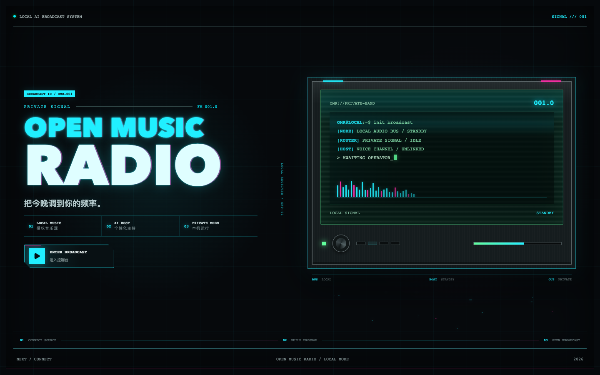
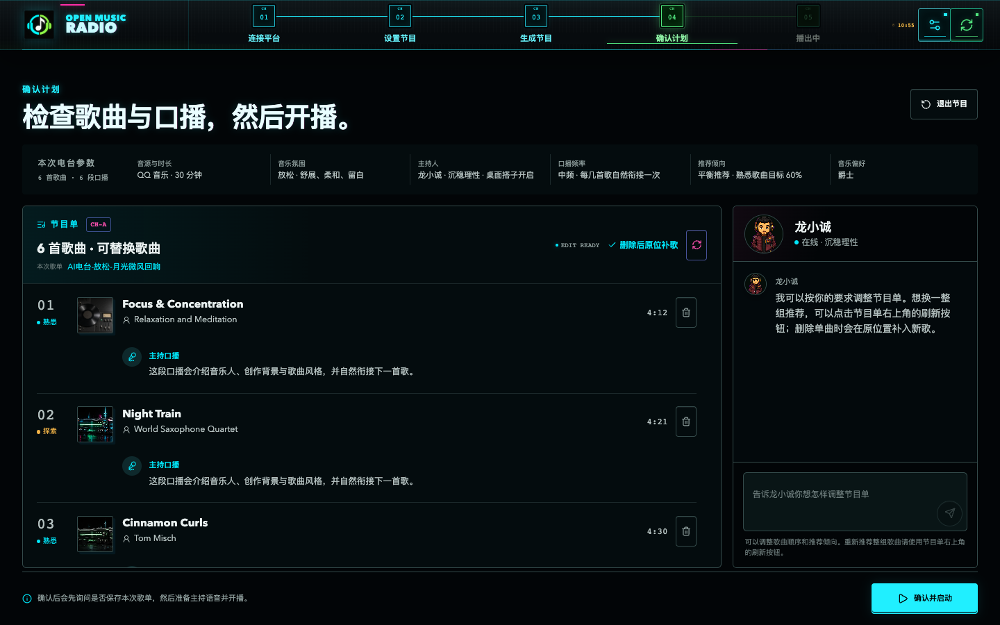

  

<h1 align="center">OpenMusicRadio</h1>

把自己的音乐账号变成一档有主持人的私人电台。

## 为此刻选一档音乐

OpenMusicRadio 会根据你在 QQ 音乐或网易云音乐里的收藏和听歌习惯，生成一档属于你的音乐节目。

想听熟悉的歌，可以让节目多放一些自己喜欢过的作品。想换换口味，也可以选择多点探索，从符合当前氛围的歌单里找到还没听过的音乐。歌曲会按照整档节目的情绪和节奏重新编排，听起来更像一档完整的电台节目。

你可以按音乐氛围选歌，也可以直接指定喜欢的风格。放松、专注、运动、通勤和派对都有各自的编排方式。

## 六位主持人

节目提供六位拥有不同声音和表达方式的主持人。有人安静细腻，有人清爽直接，也有人更适合热闹、有活力的节目。

主持人会自然地介绍音乐人、歌曲风格、创作背景和经典作品背后的故事。熟悉的歌会简短带过，值得认识的新歌会多讲一点。开启桌面陪伴后，主持人还会以像素角色出现在桌面上，平时安静陪伴，口播时才开口说话。

## 开始一档节目

1. 连接 QQ 音乐或网易云音乐账号。
2. 选择节目时长、推荐方式、熟悉程度和主持人。
3. 查看生成的歌单与全部口播，按需要调整歌曲或顺序。
4. 确认后开始播放。

播放过程中可以暂停、切换下一首，也可以把喜欢的歌曲加入音乐平台的“我喜欢”。节目结束后，本次歌单可以保留在音乐账号中，也可以自动删除。

## 隐私

音乐账号授权、听歌画像和节目记录保存在用户自己的 Mac 上。用户不需要提供账号密码，也不需要配置大模型或语音服务的密钥。

## 当前状态

OpenMusicRadio 目前是 macOS 测试版本，公开安装包尚未发布。

开发者可以查看 [本地运行说明](DEVELOPMENT.md)。社区仓库只包含客户端与本地运行所需代码，不包含托管服务、生产密钥和内部设计资料。

## License

[MIT](LICENSE)
